# Hi there, I'm sotashimozono 👋

I'm a Master's student at the University of Tokyo.

**[WINGS-ABC](https://wings-abc.c.u-tokyo.ac.jp/) Fellow** | **Theoretical Physics Researcher** | **Systems & Julia Developer**

---

### 💼 Work & Availability
I am open for collaborations.
* 📩 **Contact:** `shimozono-sota631@g.ecc.u-tokyo.ac.jp`

---

- 📄 CV
  - [Academic CV](https://github.com/sotashimozono/sotashimozono/releases/download/cv-latest/sota-shimozono-cv-academic.pdf) : publications, presentations, and fellowships.
  - [General CV](https://github.com/sotashimozono/sotashimozono/releases/download/cv-latest/sota-shimozono-cv.pdf) : everything else.
- 📖 Work
  - Quantum many-body systems especially in one-dimension
  - Matrix Product States (MPS) / Tensor Network states and algorithms
- 🛠️ Projects
  - [obsidian-remote-ssh](https://github.com/sotashimozono/obsidian-remote-ssh) : VS Code Remote SSH-style editing for Obsidian.
  - [doiget](https://github.com/QAtlasHub/doiget) : Single-binary Rust CLI + stdio MCP server for paper retrieval.
  - [QAtlas.jl](https://github.com/QAtlasHub/QAtlas.jl) / [AbstractQAtlas.jl](https://github.com/QAtlasHub/AbstractQAtlas.jl): Reference of rigorous results for quantum many-body systems.
  - [LatticeCore.jl](https://github.com/sotashimozono/LatticeCore.jl) / [Lattice2D.jl](https://github.com/sotashimozono/Lattice2D.jl) / [QuasiCrystal.jl](https://github.com/sotashimozono/QuasiCrystal.jl) : 2D lattice geometries for physics simulations.
  - [TestShards.jl](https://github.com/QAtlasHub/TestShards.jl) : Balanced, timing-informed CI test sharding for Julia.
- 📝 Articles
  - [Environment-MPO (Physical Review B, 113(24), 245116)](https://doi.org/10.1103/bbnt-brjz)
- 💻 Tech Stack
  - Language:   
  - Tools: `Obsidian`/`VSCode`/`AntiGravity`/`ClaudeCode`

---

  
  

